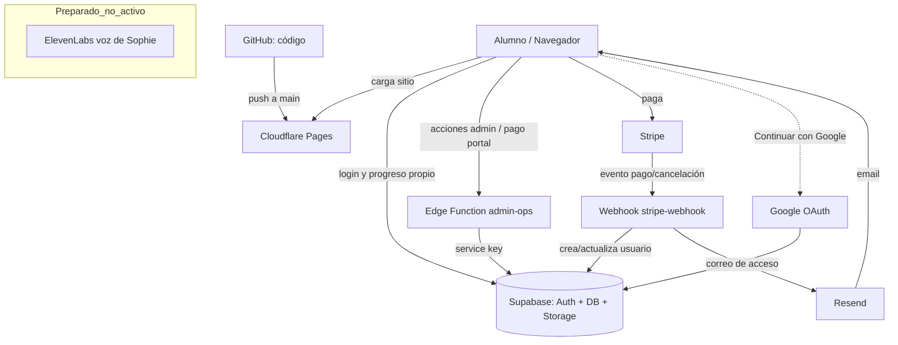

# Ecosistema de la plataforma — Sueco con Sophie

> Explicación sencilla de cómo está construida la plataforma, para que cualquier administrador la entienda sin ser técnico. Detectado automáticamente del proyecto; **no incluye ninguna clave ni credencial**.

---

## 1. Herramientas y servicios que USA la plataforma (detectados)

| Servicio | Para qué sirve | Qué guarda |
|---|---|---|
| **Supabase** | Cerebro del backend: autenticación, base de datos (PostgreSQL), almacenamiento de archivos (imágenes) y "edge functions" (código seguro del lado servidor). | Cuentas, progreso de alumnos, configuración, reseñas, imágenes. |
| **Stripe** | Cobros y suscripciones. Payment Links para mensual y trimestral + un webhook que avisa de cada pago. | Clientes, suscripciones, pagos (los datos de tarjeta viven en Stripe, no en tu base). |
| **Cloudflare Pages** | Hosting: publica el sitio web (estático) y lo sirve rápido en todo el mundo. Deploy automático desde GitHub. | La versión publicada del sitio. |
| **GitHub** | Guarda el código y su historial (control de versiones). Cloudflare despliega desde aquí. | Todo el código y commits. |
| **Resend** | Envío de correos (el correo de acceso "crea tu contraseña", soporte). | Registros de envío de correos. |
| **Google OAuth** | Opción "Continuar con Google" para iniciar sesión. | Nada nuevo: usa la cuenta Google del alumno para autenticar. |
| **ElevenLabs** | Voz clonada de Sophie para generar audios. **Estado: preparado (scripts en `scripts/audio/`) pero NO activo** (la sección de pronunciación se quitó temporalmente). | Audios generados (cuando se use). |
| **Tailwind CSS / Chart.js** | Librerías de diseño y gráficos, cargadas por CDN. | Nada (solo estilos/gráficos en el navegador). |

---

## 2. Cómo se conectan entre sí

- El **navegador del alumno** carga el sitio desde **Cloudflare Pages** y habla directamente con **Supabase** (login y lectura/escritura de su propio progreso, protegido por RLS).
- Para tareas sensibles (admin, pagos, correos), el navegador llama a una **edge function de Supabase** (`admin-ops`), que usa la clave de servicio y verifica que quien llama sea admin.
- **Stripe** cobra y, ante cada evento (pago, cancelación), llama al **webhook** (`stripe-webhook`), que crea/actualiza al usuario en Supabase y dispara el correo por **Resend**.
- **GitHub** guarda el código; al hacer push a `main`, **Cloudflare** reconstruye y publica.

---

## 3. Qué pasa en cada situación (flujos)

- **Un alumno se registra (paga):** Stripe cobra → Stripe llama al **webhook** → se crea su fila en `students` → Resend le envía el correo "crea tu contraseña".
- **Inicia sesión:** Supabase Auth valida (correo/contraseña o Google) → se comprueba que tenga cuenta activa en `students` → entra a la plataforma.
- **Completa una actividad:** el navegador guarda 1 fila en `user_progress` (u otra tabla de progreso) en Supabase, protegido por RLS (solo su propia fila).
- **Recibe un correo:** lo envía Resend (acceso, soporte), con el dominio verificado `suecoconsophie.com`.
- **Haces un deploy:** haces push a `main` en GitHub → Cloudflare Pages detecta el cambio → reconstruye y publica el nuevo `index.html`. La base de datos no se toca.

---

## 4. Archivos/módulos más importantes

- `src/app.js` — lógica principal (login, navegación, módulos, admin, pagos).
- `src/progress.js` — sistema de progreso (guardado, cálculo, migración).
- `src/achievements.js` — logros, medallas y certificados.
- `src/data.js` — todo el contenido (gramática, lecturas, escritura, audios, prueba de nivel).
- `src/template.html` — todas las pantallas (vistas) y modales.
- `supabase/functions/admin-ops/index.ts` — operaciones seguras de admin.
- `webhooks/stripe-webhook.ts` — recibe los eventos de Stripe.
- `supabase/migrations/*.sql` — definición de tablas y seguridad (RLS).

---

## 5. Tablas principales y su función

| Tabla | Función |
|---|---|
| `students` | Cuenta de cada usuario (email, estado, plan, dispositivos, IDs de Stripe). |
| `user_progress` | Progreso de la mayoría de módulos (1 fila por actividad completada). |
| `exam_progress` | Exámenes finales por nivel. |
| `vocabulary_progress` | Vocabulario dominado. |
| `tala_progress` | Progreso de conversación (Tala). |
| `medborgarskap_progress` | Progreso de la prueba de ciudadanía. |
| `nivel_resultados` | Resultados de la prueba de nivel. |
| `reviews` | Reseñas de alumnos (para la landing). |
| `config` | Configuración editable (p. ej. link de pago de Stripe). |
| `avatars` | Imágenes de perfil de los alumnos. |

---

## 6. Variables de entorno (solo NOMBRES, nunca valores)

**Edge functions / webhook (servidor, secretas):**
- `SUPABASE_URL`
- `SUPABASE_SERVICE_ROLE_KEY`
- `STRIPE_SECRET_KEY`
- `STRIPE_WEBHOOK_SECRET`
- `RESEND_API_KEY`
- `ADMIN_EMAILS`
- `SUPPORT_EMAIL`

**Frontend (pública, no secreta):**
- `SUPABASE_URL` y `SUPABASE_ANON_KEY` (clave anónima; segura de exponer porque la RLS protege los datos).

> ⚠️ Nunca se muestran los valores. Las claves de servicio, secretos de webhook y API keys viven solo en la configuración de las funciones, jamás en el frontend ni en el repositorio.

---

## 7. Diagrama del flujo (visual)

---

## 8. Guía de diagnóstico (qué revisar primero)

| Síntoma | Dónde revisar primero |
|---|---|
| Un alumno pagó pero no aparece / no recibió correo | Stripe → el pago; luego los **logs del webhook** (`stripe-webhook`); luego Resend (envío). |
| No puede iniciar sesión | Supabase → Authentication (¿existe el usuario?); tabla `students` (¿`active`?, ¿`status`?). |
| Un alumno ve datos de otro / error de permisos | Supabase → RLS de la tabla afectada (debe ser `auth.uid() = ...`). |
| El sitio no se actualizó tras un cambio | Cloudflare Pages → **Deployments** (¿construyó `main`?, ¿falló?). |
| No llegan correos | Resend → estado de envío y dominio verificado. |
| "No deployment available" | La rama no es la de producción; hay que fusionar a `main`. |
| El % de un alumno bajó | Es normal si se añadió contenido nuevo (denominadores dinámicos); el progreso NO se pierde. |

---

## 9. Enlaces rápidos a los paneles externos

- **GitHub (código):** https://github.com/andreecampos/sueco-con-sophie
- **Supabase (base de datos, auth, funciones):** https://supabase.com/dashboard/project/nblxzqdtczitpzxdqexz
- **Stripe (pagos):** https://dashboard.stripe.com
- **Cloudflare Pages (hosting):** https://dash.cloudflare.com
- **Resend (correos):** https://resend.com/emails
- **ElevenLabs (voz, cuando se use):** https://elevenlabs.io

---

## 10. Nota sobre "actualización automática"

Este documento describe el estado real detectado hoy. Para que se **actualice solo** cuando cambie la arquitectura, la propuesta (Fase 1 del dashboard) es una pantalla **"Ecosistema de la plataforma"** dentro del panel de admin que lea en vivo: qué variables de entorno están configuradas (solo nombres), qué tablas existen, y estos flujos/enlaces — regenerándose desde el propio sistema. Mientras tanto, este `.md` cumple la misma función y se actualiza en cada revisión.
